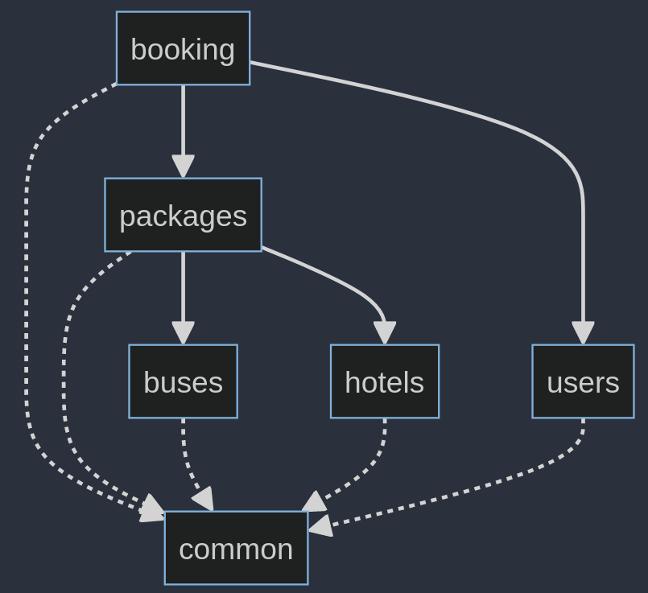

# Software Architectures (SS G653) Project

This repository contains a microservices based project on a travel management system. The software is composed of 5 
services:
- [booking](./booking)
- [buses](./buses)
- [hotels](./hotels)
- [packages](./packages)
- [users](./users)

A [common](./common) module holds the common logic/shared classes across the entire project. Each service is built 
using Spring Boot and hosted in Docker containers (see [deployment](./deployment)). Additionally, each service has its 
own independent H2 database.

Below is the dependency graph. (_In case the below graph does not load correctly_)



The code is written in Java 21 (Gradle build system) using Spring Boot and is deployed using Docker (Docker Compose).

## Building The Code

In each service directory, run

```shell
# on Linux/macOS
./gradlew bootBuildImage

# on Windows
.\gradlew.bat bootBuildImage
```

## Running The Code

In the [deployment](./deployment) directory, run

```shell
docker compose up -d
```

## Testing The APIs

Import the [api.har](./api.har) file into Postman or Insomnia and test the APIs. Change the username and passwords for 
the user login APIs. Additionally, all authenticated APIs (`users` and `booking`) require the `X-Auth-Key` HTTP header 
to be set as per the response of the login request. 